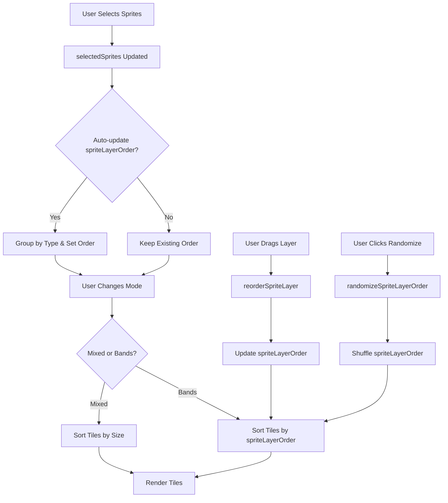

# Sprite Layer Ordering System

## Overview

Currently, when multiple sprites are selected, they render in the order they appear in the tile array. This plan adds a layer ordering system that gives users control over sprite stacking:

- **Mixed Mode**: Sprites are sorted by size (larger sprites render in front)
- **Bands Mode**: Sprites are grouped by type into layers that can be reordered via drag-and-drop

## Current Stacking Behavior

From `src/generator.ts`:

- In parallax mode, tiles are sorted by `parallaxDepth` (lines 3473-3475)
- Otherwise, tiles render in array order
- Each tile has a `spriteId` property that identifies the sprite type
- Tiles are stored in `PreparedLayer.tiles[]` arrays

## Implementation Plan

### 1. Add State Properties

**File:** `src/generator.ts` (GeneratorState interface, ~line 174)Add new properties:

```typescript
layerOrderMode: "mixed" | "bands"; // Default: "bands"
spriteLayerOrder: string[]; // Array of sprite identifiers in render order (for bands mode)
globalParallaxEnabled: boolean; // Apply size-based depth speed scaling to all movement modes
```

**File:** `src/generator.ts` (DEFAULT_STATE, search for it)Initialize defaults:

```typescript
layerOrderMode: "bands",
spriteLayerOrder: [], // Will be auto-populated from selectedSprites
globalParallaxEnabled: false, // Default: off (only parallax mode uses depth-based speed)
```


### 2. Store Sprite Identifier on Tiles

**File:** `src/generator.ts` (SvgTile interface, ~line 129)Add property:

```typescript
spriteIdentifier: string; // Sprite identifier (from selectedSprites array)
```

**File:** `src/generator.ts` (computeSprite function, ~line 1437)When creating tiles, store the sprite identifier:

```typescript
const selectedSpriteId = selectWeightedSprite();
const spriteInfo = getSpriteInfo(selectedSpriteId);
// ... existing tile creation code ...
tile.spriteIdentifier = selectedSpriteId;
```

**Also modify parallax depth calculation** (~line 1530) to include global parallax:

```typescript
// Assign parallax depth (0-1) for parallax mode OR when global parallax is enabled
// Depth is DERIVED FROM SPRITE SIZE - smaller sprites are further away (slower)
// 0 = farthest (smallest, slowest), 1 = closest (largest, fastest)
// Normalize scale to 0-1 range based on min/max scale factors
const parallaxDepth = (state.movementMode === "parallax" || state.globalParallaxEnabled)
  ? clamp((scale - MIN_TILE_SCALE) / (MAX_TILE_SCALE - MIN_TILE_SCALE), 0, 1)
  : undefined;
```


### 3. Implement Layer Ordering Logic

**File:** `src/generator.ts` (rendering loop, ~line 3463)Modify tile sorting logic to respect layer order mode. **Note:** This adds sorting overhead similar to existing parallax mode, which is already proven acceptable.**Also modify movement calculation** to apply depth-based speed scaling when `globalParallaxEnabled` is true:In `computeMovementOffsetsWithCustom` or the render loop, when calculating movement:

```typescript
// Apply global parallax depth speed scaling if enabled (and not already in parallax mode)
if (currentState.globalParallaxEnabled && currentState.movementMode !== "parallax" && tile.parallaxDepth !== undefined) {
  const depth = tile.parallaxDepth;
  const depthEffect = (currentState.parallaxDepthEffect ?? 50) / 100;
  const slowestMultiplier = 1.0 - depthEffect * 0.99;
  const fastestMultiplier = 1.0;
  const depthSpeedMultiplier = slowestMultiplier + depth * (fastestMultiplier - slowestMultiplier);
  
  // Apply depth speed multiplier to the movement calculation
  // This affects the speedFactor or time parameter passed to computeMovementOffsets
  speedFactor *= depthSpeedMultiplier;
}
```

**Note:** This makes larger sprites move faster in any animation mode, creating a depth perception effect.**When Global Parallax Makes Sense:**

- **Movement-based modes**: drift, spiral, cascade, ripple, comet, zigzag, linear, isometric, triangular - creates clear depth illusion
- **Works well with**: Any mode where sprites move through space

**When Global Parallax Has Less Effect:**

- **Scale-only modes**: pulse, pulse-meander - no position movement, so speed scaling has minimal visual impact
- **Parallax mode**: Already has depth-based speed, so toggle is disabled (redundant)

**User Experience:**

- Toggle is disabled when `movementMode === "parallax"` (already has depth)
- Tooltip explains it works best with movement-based animations
- Visual feedback shows which mode is active
```typescript
prepared.layers.forEach((layer, layerIndex) => {
  if (layer.tiles.length === 0) {
    return;
  }
  const baseLayerSize = drawSize * layer.baseSizeRatio;

  p.push();
  
  // Determine tile rendering order based on layer order mode
  let tilesToRender: PreparedTile[];
  
  if (currentState.movementMode === "parallax") {
    // Parallax mode: sort by depth first
    tilesToRender = [...layer.tiles].sort((a, b) => 
      (a.parallaxDepth ?? 0.5) - (b.parallaxDepth ?? 0.5)
    );
  } else if (currentState.layerOrderMode === "mixed") {
    // Mixed mode: sort by size (larger sprites in front)
    tilesToRender = [...layer.tiles].sort((a, b) => {
      const sizeA = baseLayerSize * a.scale;
      const sizeB = baseLayerSize * b.scale;
      return sizeB - sizeA; // Descending order (larger first)
    });
  } else {
    // Bands mode: sort by sprite type order, then by existing order
    const layerOrder = currentState.spriteLayerOrder || [];
    tilesToRender = [...layer.tiles].sort((a, b) => {
      const indexA = layerOrder.indexOf(a.spriteIdentifier);
      const indexB = layerOrder.indexOf(b.spriteIdentifier);
      // If sprite not in order array, put it at the end
      if (indexA === -1 && indexB === -1) return 0;
      if (indexA === -1) return 1;
      if (indexB === -1) return -1;
      return indexA - indexB;
    });
  }
  
  tilesToRender.forEach((tile, tileIndex) => {
    // ... existing rendering code ...
  });
});
```


### 4. Auto-Initialize Layer Order

**File:** `src/generator.ts` (createSpriteController, ~line 4790)When sprites are selected/deselected, auto-update `spriteLayerOrder`:In `toggleSpriteSelection`:

```typescript
// After updating selectedSprites, update spriteLayerOrder
const newSelected = /* ... existing logic ... */;
const currentOrder = stateRef.current.spriteLayerOrder || [];
const newOrder = newSelected.filter(id => currentOrder.includes(id))
  .concat(newSelected.filter(id => !currentOrder.includes(id)));
applyState({ 
  selectedSprites: newSelected,
  spriteLayerOrder: newOrder.length > 0 ? newOrder : newSelected
});
```


### 5. Add Controller Methods

**File:** `src/generator.ts` (SpriteController interface, ~line 4378)Add methods:

```typescript
setLayerOrderMode: (mode: "mixed" | "bands") => void;
setSpriteLayerOrder: (order: string[]) => void;
reorderSpriteLayer: (fromIndex: number, toIndex: number) => void;
randomizeSpriteLayerOrder: () => void; // Randomly shuffle spriteLayerOrder
setGlobalParallaxEnabled: (enabled: boolean) => void; // Enable size-based depth speed for all modes
```

**File:** `src/generator.ts` (controller implementation)Implement methods:

```typescript
setLayerOrderMode: (mode: "mixed" | "bands") => {
  applyState({ layerOrderMode: mode }, { recompute: false });
},
setSpriteLayerOrder: (order: string[]) => {
  applyState({ spriteLayerOrder: order }, { recompute: false });
},
reorderSpriteLayer: (fromIndex: number, toIndex: number) => {
  const currentState = stateRef.current;
  const currentOrder = [...(currentState.spriteLayerOrder || [])];
  const reordered = arrayMove(currentOrder, fromIndex, toIndex);
  applyState({ spriteLayerOrder: reordered }, { recompute: false });
},
randomizeSpriteLayerOrder: () => {
  const currentState = stateRef.current;
  const currentOrder = [...(currentState.spriteLayerOrder || [])];
  // Fisher-Yates shuffle algorithm
  const shuffled = [...currentOrder];
  for (let i = shuffled.length - 1; i > 0; i--) {
    const j = Math.floor(Math.random() * (i + 1));
    [shuffled[i], shuffled[j]] = [shuffled[j], shuffled[i]];
  }
  applyState({ spriteLayerOrder: shuffled }, { recompute: false });
},
setGlobalParallaxEnabled: (enabled: boolean) => {
  applyState({ globalParallaxEnabled: enabled }, { recompute: true }); // Recompute to calculate depths
},
```

Note: Import `arrayMove` from `@dnd-kit/sortable` (already used in project).

### 6. Create LayersControls Component

**File:** `src/components/ControlPanel/LayersControls.tsx` (new file)Follow established component patterns from `SpriteControls.tsx`, `ColourControls.tsx`, `MotionControls.tsx`, and `FxControls.tsx`:**Structure:**

- Start with `<h2 className="panel-heading">Layers</h2>`
- Use `<div className="section">` for first section
- Use `<div className="section section--spaced">` with `<hr className="section-divider border-t" />` for subsequent sections
- Use `<h3 className="section-title">` for section titles
- Use `<div className="control-field">` for control groups

**Mode Toggle Section:**

```tsx
<div className="section">
  <div className="flex items-center justify-between gap-2">
    <div className="flex items-center gap-2">
      <TextWithTooltip
        id="layer-order-mode-tip"
        text="Choose how sprites are stacked: Mixed (sorted by size) or Bands (grouped by type with custom order)."
      >
        <h3 className="section-title">Layer order</h3>
      </TextWithTooltip>
    </div>
    <Switch
      checked={spriteState.layerOrderMode === "bands"}
      onCheckedChange={(checked) => 
        controller?.setLayerOrderMode(checked ? "bands" : "mixed")
      }
      disabled={!ready || (spriteState.selectedSprites?.length ?? 0) < 2}
      aria-label="Use bands mode"
    />
  </div>
  {/* Show label for current mode */}
  <div className="text-xs text-theme-subtle mt-1">
    {spriteState.layerOrderMode === "bands" ? "Bands" : "Mixed (by size)"}
  </div>
</div>
```

**Bands List Section** (visible only in bands mode and when 2+ sprites selected):

```tsx
{spriteState.layerOrderMode === "bands" && 
 (spriteState.selectedSprites?.length ?? 0) >= 2 && (
  <div className="section section--spaced">
    <hr className="section-divider border-t" />
    <h3 className="section-title">Layer order</h3>
    
    {/* Drag-and-drop list using @dnd-kit */}
    <DndContext ...>
      <SortableContext ...>
        {/* Sortable band items */}
      </SortableContext>
    </DndContext>
    
    {/* Randomize button - use switch-row pattern */}
    <div className="control-field control-field--spaced-top">
      <div className="switch-row">
        <Button
          ref={randomizeButtonRef}
          type="button"
          size="icon"
          variant="secondary"
          onClick={() => {
            if (randomizeButtonRef.current) {
              animatePulse(randomizeButtonRef.current);
            }
            controller?.randomizeSpriteLayerOrder();
          }}
          disabled={!ready}
          aria-label="Randomise layer order"
          title="Randomise layer order"
        >
          <RefreshCw className="h-6 w-6" />
        </Button>
        <div className="field-heading-left">
          <TextWithTooltip
            id="randomize-layers-tip"
            text="Completely shuffle the z-index order of all sprite layers randomly."
          >
            <span className="field-label" id="randomize-layers-label">
              Randomise order
            </span>
          </TextWithTooltip>
        </div>
      </div>
    </div>
  </div>
)}
```

**Empty State** (when only one sprite selected):

```tsx
{(spriteState.selectedSprites?.length ?? 0) < 2 && (
  <div className="section section--spaced">
    <hr className="section-divider border-t" />
    <div className="control-field">
      <p className="text-sm text-theme-subtle">
        Select 2 or more sprites to control layer ordering.
      </p>
    </div>
  </div>
)}
```

**Key Implementation Details:**

- Import `RefreshCw` from `lucide-react` for randomize button
- Import `GripVertical` from `lucide-react` for drag handles
- Use `@dnd-kit` components: `DndContext`, `SortableContext`, `useSortable`, `arrayMove`
- Use `animatePulse` from `@/lib/utils/animations` for button feedback
- Use `TextWithTooltip` for all labels with tooltips
- Follow `switch-row` pattern for buttons with labels (icon button + label)
- Use `control-field--spaced-top` for spacing after lists
- Group sprites by type when displaying bands (use `findSpriteByIdentifier` to get sprite info)
- Show sprite icons using `ShapeIcon` component (from shared)
- Each sortable item should show: drag handle + sprite icon + sprite name
- Visual order: top of list = front (renders last), bottom = back (renders first)

### 7. Add Navigation Item

**File:** `src/components/layout/AppSidebar.tsx` (~line 151)Add to navigationItems:

```typescript
const navigationItems = [
  { value: "sprites" as const, label: "Shape", icon: Shapes },
  { value: "colours" as const, label: "Colour", icon: Palette },
  ...(isWideLayout ? [] : [{ value: "motion" as const, label: "Animation", icon: PlayCircle }]),
  { value: "layers" as const, label: "Layers", icon: Layers }, // NEW
  { value: "fx" as const, label: "FX", icon: Sparkles },
];
```

Import `Layers` icon from `lucide-react`.**File:** `src/components/layout/AppSidebar.tsx` (~line 14)Update activePanel type:

```typescript
activePanel: "sprites" | "colours" | "motion" | "layers" | "fx";
```

**File:** `src/components/layout/AppSidebar.tsx` (~line 334)Add LayersControls panel:

```typescript
{activePanel === "layers" && (
  <LayersControls
    spriteState={spriteState}
    controller={controller}
    ready={ready}
  />
)}
```


### 8. Update App.tsx Integration

**File:** `src/App.tsx`Update `activePanel` state type and handlers to include "layers".

### 9. Group Sprites by Type in Bands Mode

**File:** `src/generator.ts` (computeSprite or controller)When initializing `spriteLayerOrder`, group sprites by type:

- Extract sprite type from identifier (e.g., "line", "square", etc.)
- Group identifiers by type
- Order groups, then order within groups

Helper function to get sprite type from identifier:

```typescript
function getSpriteType(identifier: string): string {
  const spriteInfo = getSpriteInfo(identifier);
  return spriteInfo?.svgSprite.id || "unknown";
}
```


## Data Flow




## Testing Considerations

1. Test with 2+ sprites selected
2. Test mode switching (mixed ↔ bands)
3. Test drag-and-drop reordering
4. Test randomize button (should shuffle order randomly)
5. Test with parallax mode (should still sort by depth first)
6. Test with single sprite (layers panel should be disabled/empty or show message)
7. Test sprite selection changes (order should update appropriately)
8. Test UI visibility (bands list and randomize button only visible in bands mode)

## Performance Considerations

### Current Performance Baseline

- **Parallax mode already sorts tiles every frame** (line 3473-3475 in `generator.ts`)
- Typical tile counts: ~50-70 tiles per layer, 3 layers = ~150-200 tiles total
- Sorting happens in the render loop (60fps), so ~60 sorts per second
- Current parallax sorting: O(n log n) on ~50-70 items = ~300-500 operations per layer per frame

### Impact of Layer Ordering

**Mixed Mode (sort by size):**

- Adds O(n log n) sort every frame (same as parallax mode)
- Calculates size for each tile during sort: `baseLayerSize * tile.scale`
- Impact: Similar to existing parallax mode - **minimal, already proven acceptable**

**Bands Mode (sort by layer order):**

- Adds O(n log n) sort every frame
- Uses `indexOf` lookup in `spriteLayerOrder` array (O(m) where m = number of sprite types, typically 2-5)
- Total: O(n log n * m) but m is small, so effectively O(n log n)
- Impact: **Slightly more expensive than mixed mode, but still minimal**

### Optimization Strategies (if needed)

1. **Cache sorted arrays** when `layerOrderMode` and `spriteLayerOrder` haven't changed

- Only re-sort when state changes
- Store sorted arrays per layer in a cache
- Clear cache when relevant state changes

2. **Pre-compute sort keys** for bands mode

- Create a Map of spriteIdentifier -> sortIndex during state update
- Use Map lookup (O(1)) instead of indexOf (O(m)) during sort
- Reduces sort comparison overhead

3. **Only sort when needed**

- Skip sorting if only one sprite type is selected
- Skip sorting if all sprites are the same type

### Recommendation

**Start with simple implementation** (sort every frame):

- Parallax mode already proves this is acceptable
- Tile counts are relatively small (~50-70 per layer)
- Modern JS engines handle this efficiently
- Keep code simple and maintainable

**Add optimizations later if profiling shows issues:**

- Profile with browser DevTools Performance tab
- Only optimize if frame rate drops below 60fps
- Most likely bottleneck is rendering, not sorting

## Migration Notes

- Existing scenes will default to "bands" mode with auto-generated order
- No breaking changes to existing state structure